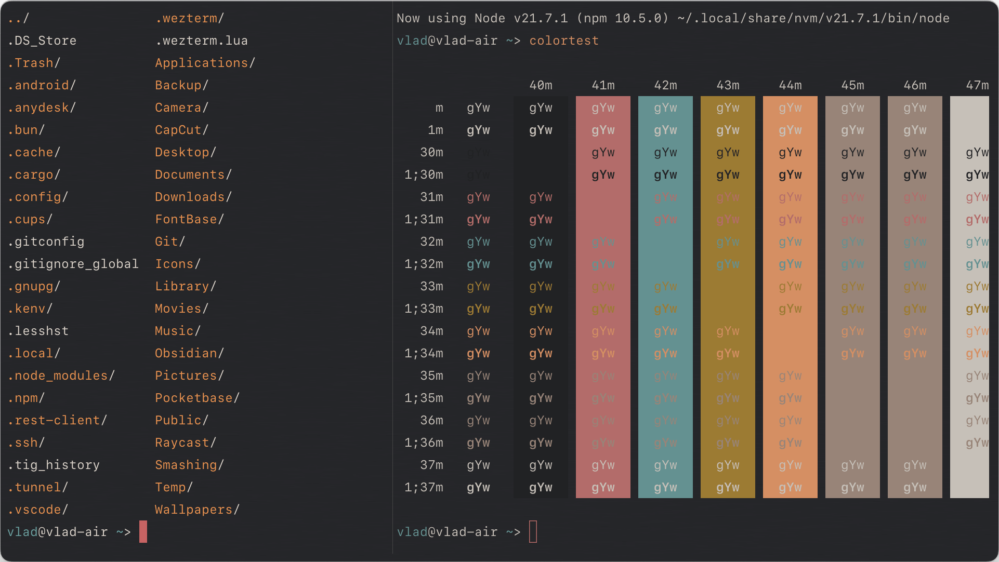
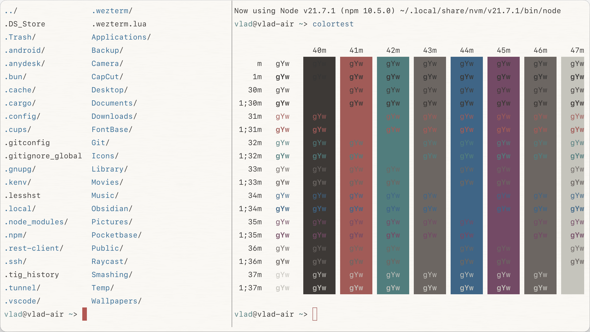

### Install Tirini themes for Wezterm

1. Save theme files to `~/.wezterm/themes` : 

```
mkdir -p ~/.wezterm/themes
```

```
curl -o ~/.wezterm/themes/Tiniri-Dark.toml https://tiniri.vlad.studio/themes/wezterm/Tiniri-Dark.toml
```

```
curl -o ~/.wezterm/themes/Tiniri-Dark.png https://tiniri.vlad.studio/patterns/Tiniri-Dark.png
```

```
curl -o ~/.wezterm/themes/Tiniri-Light.toml https://tiniri.vlad.studio/themes/wezterm/Tiniri-Light.toml
```

```
curl -o ~/.wezterm/themes/Tiniri-Light.png https://tiniri.vlad.studio/patterns/Tiniri-Light.png
```

---

2. Open wezterm confid in your editor of choice, e.g.

```
micro ~/.wezterm.lua
```

---

3. Add this code if it's not there yet:

```
local wezterm = require 'wezterm'
local config = wezterm.config_builder()
```

---

4. Apply a theme (e.g. Dark), replacing PATH/TO/HOME with actual path to your user home folder (e.g. `/Users/vlad/`):

```
config.color_scheme_dirs = { '/PATH/TO/HOME/.wezterm/themes' }
config.color_scheme = 'Tiniri Dark'
config.background = {
  {
    source = {
      File = '/PATH/TO/HOME/.wezterm/themes/Tiniri-Dark.png',
    },
    width = 600,
    height = 600,
    repeat_x = 'Mirror',
    repeat_y = 'Mirror',
  },
}
```

---

5. Add this code at the very end if it's not there yet:
```
return config
```